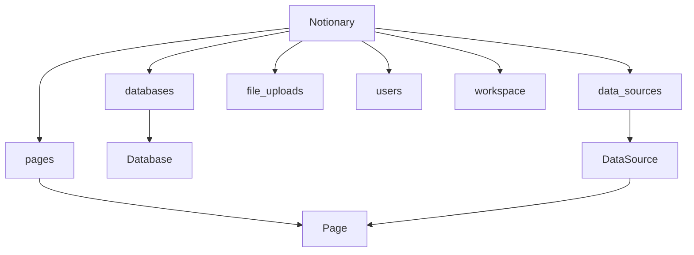

<picture>
  <source media="(prefers-color-scheme: dark)" srcset="./static/notionary-dark.png">
  <source media="(prefers-color-scheme: light)" srcset="./static/notionary-light.png">
  
</picture>

<h1 align="center">The Modern Notion API for Python & AI Agents</h1>

<div align="center">

[](https://badge.fury.io/py/notionary)
[](https://www.python.org/downloads/)
[](https://opensource.org/licenses/MIT)
[](https://pypi.org/project/notionary/)
[](https://mathisarends.github.io/notionary)
[](https://developers.notion.com/)

**Transform complex Notion API interactions into simple, Pythonic code.**
Perfect for developers building AI agents, automation workflows, and dynamic content systems.

</div>

---

## Why Notionary?

- **AI-friendly** – Composable APIs that drop cleanly into agent workflows
- **Smart discovery** – Find pages/databases by title with fuzzy matching (no ID spelunking)
- **Markdown content** – Read & write page content as Markdown via the [Notion Markdown API](https://developers.notion.com/reference/retrieve-page-markdown)
- **Async-first** – Modern Python with full `async` / `await`
- **Round-trip content** – Read a page as Markdown, transform, write back
- **Full coverage** – Pages, databases, data sources, file uploads, users, workspace search

---

## Installation

```bash
pip install notionary
```

Set up your [Notion integration](https://www.notion.so/profile/integrations) and configure your token:

```bash
export NOTION_API_KEY=your_integration_key
```

---

## Quick Start

All access goes through the `Notionary` client:

```python
import asyncio
from notionary import Notionary

async def main():
    async with Notionary() as notion:
        # Find a page by title (fuzzy matching)
        page = await notion.pages.from_title("Meeting Notes")
        print(page.title, page.url)

        # Read content as Markdown
        md = await page.get_markdown()
        print(md)

        # Append content
        await page.append("## Action Items\n- [ ] Review proposal")

        # Replace all content
        await page.replace("# Fresh Start\nThis page was rewritten.")

asyncio.run(main())
```

---

## Architecture Overview



The `Notionary` client exposes **namespace** objects – each mapping to a Notion API area.
Content operations use the [Notion Markdown API](https://developers.notion.com/reference/retrieve-page-markdown) directly.

---

## Core Concepts

### Pages

```python
async with Notionary() as notion:
    # Lookup
    page = await notion.pages.from_title("Sprint Board")
    page = await notion.pages.from_id(page_uuid)

    # List & search
    pages = await notion.pages.list(query="roadmap")

    # Content (Markdown API)
    md = await page.get_markdown()
    await page.append("## New Section")
    await page.replace("# Replaced content")
    await page.clear()

    # Metadata
    await page.rename("New Title")
    await page.set_icon("🚀")
    await page.set_cover("https://example.com/cover.png")
    await page.random_cover()

    # Properties
    await page.properties.set_property("Status", "Done")

    # Comments
    await page.comment("Review completed")

    # Lifecycle
    await page.lock()
    await page.trash()
```

> **Notion API Reference:** [Pages](https://developers.notion.com/reference/page) · [Markdown](https://developers.notion.com/reference/retrieve-page-markdown)

### Databases

```python
async with Notionary() as notion:
    db = await notion.databases.from_title("Tasks")
    db = await notion.databases.from_id(db_uuid)

    # Create
    db = await notion.databases.create(
        parent_page_id=page_uuid,
        title="New Database",
        icon_emoji="📊",
    )

    # Metadata
    await db.set_title("Project Tracker")
    await db.set_description("All current projects")
    await db.set_icon("📊")
    await db.lock()
```

> **Notion API Reference:** [Databases](https://developers.notion.com/reference/database)

### Data Sources

```python
async with Notionary() as notion:
    ds = await notion.data_sources.from_title("Engineering Backlog")

    # Create a page inside the data source
    page = await ds.create_page(title="New Feature")

    # Metadata
    await ds.set_title("Sprint Board")
    await ds.set_icon("🧭")
```

> **Notion API Reference:** [Data Sources](https://developers.notion.com/reference/data-source)

### File Uploads

```python
from pathlib import Path

async with Notionary() as notion:
    # Upload from disk
    result = await notion.file_uploads.upload(Path("./report.pdf"))

    # Upload from bytes
    result = await notion.file_uploads.upload_from_bytes(
        content=image_bytes,
        filename="chart.png",
    )

    # List uploads
    uploads = await notion.file_uploads.list()
```

### Users

```python
async with Notionary() as notion:
    all_users = await notion.users.list()
    people = await notion.users.list(filter="person")
    bots = await notion.users.list(filter="bot")
    me = await notion.users.me()

    matches = await notion.users.search("alex")
```

### Workspace Search

```python
async with Notionary() as notion:
    results = await notion.workspace.search(query="roadmap")
    for r in results:
        print(type(r).__name__, r.title)
```

---

## Key Features

<table>
<tr>
<td width="50%">

### Smart Discovery

- Find pages/databases by name
- Fuzzy matching for approximate searches
- No more hunting for IDs or URLs

### Markdown Content API

- Read page content as Markdown
- Append, replace, or clear content
- Powered by the official Notion Markdown API

### Modern Python

- Full async/await support
- Type hints throughout
- Pydantic models for API responses

</td>
<td width="50%">

### Round-Trip Editing

- Read existing content as Markdown
- Edit and modify
- Write back to Notion seamlessly

### AI-Ready Architecture

- Predictable models enable prompt chaining
- Ideal for autonomous content generation
- Clean namespace-based API

### Complete Coverage

- Pages, databases, data sources
- File uploads with automatic handling
- Users and workspace search

</td>
</tr>
</table>

---

### Full Documentation

[**mathisarends.github.io/notionary**](https://mathisarends.github.io/notionary/) – Complete API reference with auto-generated docs from source code

---

## Contributing

We welcome contributions from the community! Whether you're:

- **Fixing bugs** - Help improve stability and reliability
- **Adding features** - Extend functionality for new use cases
- **Improving docs** - Make the library more accessible
- **Sharing examples** - Show creative applications and patterns

Check our [**Contributing Guide**](https://mathisarends.github.io/notionary/contributing/) to get started.

---

<div align="center">

**Ready to revolutionize your Notion workflows?**

[📖 **Read the Docs**](https://mathisarends.github.io/notionary/) · [💻 **Browse Examples**](examples/)

_Built with ❤️ for Python developers and AI agents_

</div>
