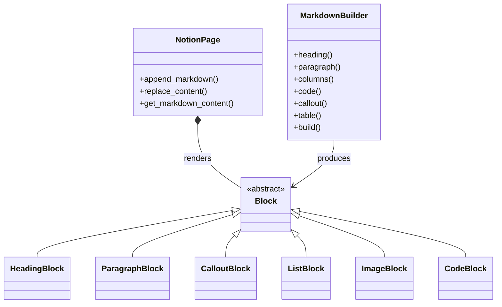

Notionary provides comprehensive support for all official Notion block types. The block system is a two‑way bridge:

1. Notion API JSON -> internal block model -> Markdown
2. Markdown (string or builder) -> internal block model -> Notion API JSON

You choose the authoring style; Notionary handles all conversion details (IDs, nesting, formatting, layout grouping).



> The public API surface for content is intentionally small: you only need `page.append_markdown()` and optionally the `MarkdownBuilder` functions.

### Captions

Some blocks support captions. In Markdown, add a `[caption]` line immediately below the block. The following block types support captions:

- Audio
- Bookmark
- Code
- Embed
- File
- Image
- PDF
- Video

Example:

```markdown
[image](./assets/screenshot.png)
[caption] Main dashboard view
```

## Philosophy

- Predictable authoring: The builder is explicit and type‑guided.
- Human friendly: Raw Markdown stays convenient for quick notes & docs.
- Round‑trip safety: Imported Notion content converts to Markdown and can be re‑applied (idempotent for supported blocks).
- Layout capability: Columns, tables, toggles and rich composition exposed without needing to craft raw block JSON.

---

## Two Authoring Modes

### Builder (recommended for structured / programmatic content)

Strongly typed, composable, easier to refactor, no need to memorize extended syntax.

```python
await page.append_markdown(lambda b: (
    b.heading("Release Notes", level=1)
     .callout("Deployment scheduled tonight", emoji="🚀")
     .h2("Changes")
     .bulleted_list([
        "Refactored auth middleware",
        "Improved caching layer",
        "Added experimental AI summary"
     ])
     .columns(
        lambda left: (
            left.h3("Metrics")
                .table(["Key", "Value"], [["Req/s", "412"], ["P95", "180ms"]])
        ),
        lambda right: (
            right.h3("Flags")
                .todo_list(["Enable feature X", "Launch Beta Group"], completed=[True, False])
        ),
        width_ratios=[0.55, 0.45]
     )
))
```

### Raw Markdown (quick, flexible, less structured)

Use when drafting prose or pasting existing docs. Extended syntax enables richer constructs (see individual block docs).

```python
await page.append_markdown(
"""
# Release Notes

[callout](Deployment scheduled tonight "🚀")

## Changes
- Refactored auth middleware
- Improved caching layer
- Added experimental AI summary

::: columns
::: column
### Metrics
| Key  | Value |
| ---- | ----- |
| Req/s | 412  |
| P95   | 180ms |
:::
::: column
### Flags
- [x] Enable feature X
- [ ] Launch Beta Group
:::
:::
"""
)
```

---

## Layout & Composition Highlights

Columns, toggles and nested structures are supported in both modes. The builder gives stricter guarantees (e.g. width ratio validation); the markdown parser attempts graceful recovery when structure is ambiguous.

### Column Layout (Builder)

```python
await page.append_markdown(lambda b: (
    b.columns(
        lambda c: c.h3("Left").paragraph("Primary narrative"),
        lambda c: c.h3("Right").callout("Context", emoji="ℹ️"),
        width_ratios=[0.6, 0.4]
    )
))
```

### Toggle with Nested Content

```python
await page.append_markdown(lambda b: (
    b.toggle("Advanced", lambda t: (
        t.paragraph("Low-level details")
         .code("print('ok')", language="python")
         .table(["Key", "Value"], [["Mode", "Debug"]])
    ))
))
```

---

## Error Handling & Robustness

- Length trimming where Notion imposes limits
- Graceful downgrade: unknown block types become paragraphs
- Retry layer for transient network faults
- Validation on builder API (e.g. column ratio mismatches)

---

## Minimal End‑to‑End Example

```python
from notionary import NotionPage

page = await NotionPage.from_title("Docs Sandbox")

await page.replace_content(lambda b: (
    b.h1("API Overview", level=1)
     .paragraph("This page is generated programmatically.")
     .callout("Edit safely; regeneration overwrites.", emoji="⚠️")
     .numbered_list(["Fetch data", "Transform", "Publish"])
     .toggleable_heading("Details", 2, lambda t: (
        t.code("curl https://api.example.com", language="bash")
         .equation("E = mc^2")
     ))
))

markdown_snapshot = await page.get_markdown_content()
print(markdown_snapshot)
```

---

## Best Practices

- Prefer the builder in automated pipelines (stable structure, fewer parsing ambiguities)
- Keep raw markdown lean; move logic into Python where possible
- Use `replace_content` for idempotent regeneration flows
- Validate complex tables in code before sending
- Retrieve then diff markdown snapshots for change auditing

---

## Reference

!!! info "Notion API Reference"
For the official Notion API reference on blocks, see [https://developers.notion.com/reference/block](https://developers.notion.com/reference/block)
