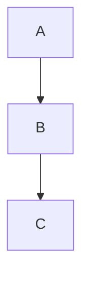

# Code

Multi-line, syntax-highlighted code blocks and diagrams (Mermaid). For short inline snippets, use backticks within a paragraph. Specify the language after the opening fence (for example, ```python) to enable syntax highlighting for many languages. Choosing the correct language is important for the Notion web UI to display proper highlighting.

## Syntax

Captions are supported by adding a `[caption]` line immediately below the block.

````markdown
```python
print("Hello")
```
[caption] Basic

```bash
pip install notionary
```
[caption] Install


[caption] Flow
````

## Common Languages

`python`, `javascript`, `bash`, `json`, `yaml`, `sql`, `mermaid`, `go`, `rust`

Full list: inspect `CodeLanguage` enum.

```python
from notionary.blocks.code import CodeLanguage
all_langs = [c.value for c in CodeLanguage]
```

## Builder

```python
from notionary.markdown import MarkdownBuilder

markdown = (MarkdownBuilder()
    .h2("Examples")
    .code('print("Hello")', 'python', 'Basic')
    .code('pip install notionary', 'bash', 'Install')
    .mermaid('graph TD; A-->B; B-->C;', 'Flow')
    .build())
```
