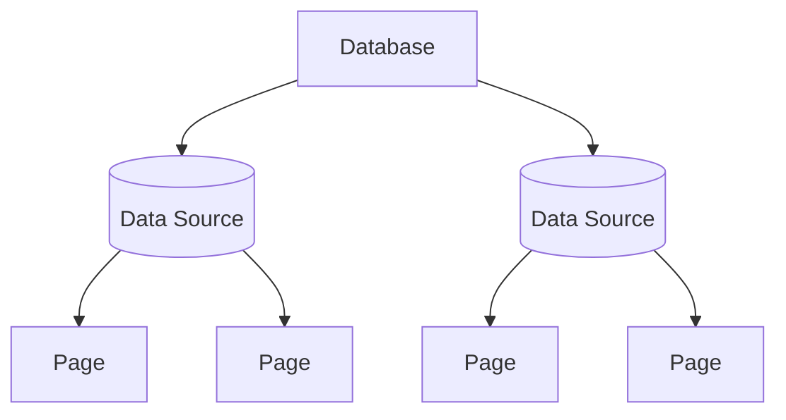

A `DataSource` represents a structured collection of rows (pages) inside a database. It exposes metadata (title, description, icon, cover, archive state) and typed property definitions. Pages created in or returned from a data source adopt these property schemas.



## Instantiating a Data Source

```python
from notionary import NotionDataSource

data_source = await NotionDataSource.from_id("your-data-source-id")
```

```python
from notionary import NotionDataSource

data_source = await NotionDataSource.from_title("Features Backlog")
```

```python
from notionary import NotionDataSource

data_source = await NotionDataSource.from_url("https://www.notion.so/your-workspace/your-data-source-id")
```

`from_title` / `from_url` use the Notion search API to find the best match.

## Metadata Operations

```python
await data_source.set_title("Sprint Board")
await data_source.set_emoji_icon("🧭")
await data_source.set_external_icon("https://example.com/icon.png")
await data_source.set_cover_image_by_url("https://example.com/cover.png")
await data_source.set_random_gradient_cover()
await data_source.remove_cover_image()
await data_source.archive()
await data_source.unarchive()
await data_source.update_description("Contains all upcoming features.")
```

All operations are async and update the in‑memory fields after a successful API response.

## Property Options

Every data source lets you inspect allowed option values for properties. This is the authoritative place to discover what values downstream pages (rows) are allowed to use.

### Get all allowed option labels

Use this when you do not care about the concrete property category and just want the permissible labels.

```python
options = await data_source.get_options_for_property_by_name("Status")
print(options)  # e.g. ['Todo', 'In Progress', 'Done']
```

### Specific helpers per property kind

```python
select_options = data_source.get_select_options_by_property_name("Phase")

multi_select_options = data_source.get_multi_select_options_by_property_name("Labels")

status_options = data_source.get_status_options_by_property_name("Status")

relation_target_titles = await data_source.get_relation_options_by_property_name("Epic")
```

Notes:

- The helpers return plain strings (option names / relation target titles). These are exactly the human‑readable values that page‑level property writer methods expect when you later set a select / multi‑select / status / relation value on an individual page.
- An empty list means either the property does not exist, has no configured options yet, or (for relations) the related data source currently has no target pages.

### Relation option discovery

For relation properties the method fetches all current target page titles from the related data source. This allows you to pre‑validate user input and present an autocomplete for cross‑workspace linking. The titles you get here are what you pass later (on the page layer) to the relation‑setting helper which resolves them internally to page IDs.

```python
related_titles = await data_source.get_relation_options_by_property_name("Epic")
for title in related_titles:
    print("Possible related page:", title)
```

## Querying pages

The `NotionDataSource` exposes top-level query helpers to find pages (rows) that belong to a data source. You must build filters explicitly with the `DataSourceQueryBuilder` and then pass the resulting params to query methods.

### Building query params

```python
# Get the builder from the data source
builder = data_source.get_query_builder()

# Configure filters and sorting
params = builder.where("Status").equals("In Progress").order_by_last_edited_time().build()

# Execute the query
pages = await data_source.get_pages(query_params=params)
```

### Query with params

```python
builder = data_source.get_query_builder()
params = builder.where("Status").equals("In Progress").order_by("Effort").build()
pages = await data_source.get_pages(query_params=params)

# Or get all pages without filters
all_pages = await data_source.get_pages()
```

### Streaming results (memory-efficient)

The stream variant returns an async generator that yields `NotionPage` objects as they are fetched. This is memory-efficient and well-suited for automated pipelines since you can process items one-by-one without loading the entire result set into memory.

```python
# Stream with filters
builder = data_source.get_query_builder()
params = builder.where("Tags").array_contains("API").build()

async for page in data_source.iter_pages(query_params=params):
    print(page.title)

# Stream all pages
async for page in data_source.iter_pages():
    print(page.title)
```

Notes:

- `get_query_builder()` returns a `DataSourceQueryBuilder` pre-configured with the data source's property definitions
- `get_pages()` accepts an optional `query_params` object; without it, fetches all pages
- `iter_pages()` works similarly but yields pages asynchronously as they are fetched

## Reference

!!! info "Notion API Reference"
For the official Notion API reference on datasources, see [https://developers.notion.com/reference/data-source](https://developers.notion.com/reference/data-source)
