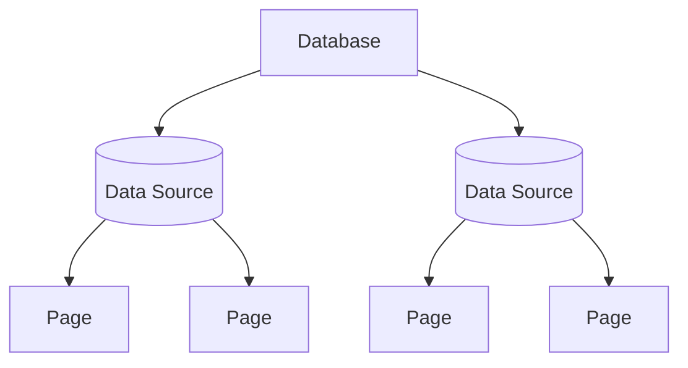

A `DataSource` represents a structured collection of rows (pages) inside a database. It exposes metadata (title, description, icon, cover, archive state) and typed property definitions. Pages created in or returned from a data source adopt these property schemas.



## Instantiating a Data Source

```python
from notionary import NotionDataSource

data_source = await NotionDataSource.from_id("your-data-source-id")
```

```python
from notionary import NotionDataSource

data_source = await NotionDataSource.from_title("Features Backlog")
```

```python
from notionary import NotionDataSource

data_source = await NotionDataSource.from_url("https://www.notion.so/your-workspace/your-data-source-id")
```

`from_title` / `from_url` use the Notion search API to find the best match.

## Metadata Operations

```python
await data_source.set_title("Sprint Board")
await data_source.set_emoji_icon("🧭")
await data_source.set_external_icon("https://example.com/icon.png")
await data_source.set_cover_image_by_url("https://example.com/cover.png")
await data_source.set_random_gradient_cover()
await data_source.remove_cover_image()
await data_source.archive()
await data_source.unarchive()
await data_source.update_description("Contains all upcoming features.")
```

All operations are async and update the in‑memory fields after a successful API response.

## Typed Property Reader

Every data source exposes a `property_reader` that lets you inspect allowed option values for properties. This is the authoritative place to discover what values downstream pages (rows) are allowed to use.

```python
reader = data_source.property_reader
```

### Get all allowed option labels (generic)

Use this when you do not care about the concrete property category and just want the permissible labels.

```python
options = await reader.get_options_for_property_by_name("Status")
print(options)  # e.g. ['Todo', 'In Progress', 'Done']
```

### Specific helpers per property kind

```python
select_options = reader.get_select_options_by_property_name("Phase")
multi_select_options = reader.get_multi_select_options_by_property_name("Labels")
status_options = reader.get_status_options_by_property_name("Status")
relation_target_titles = await reader.get_relation_options_by_property_name("Epic")
```

Notes:

- The helpers return plain strings (option names / relation target titles). These are exactly the human‑readable values that page‑level property writer methods expect when you later set a select / multi‑select / status / relation value on an individual page.
- An empty list means either the property does not exist, has no configured options yet, or (for relations) the related data source currently has no target pages.

### Relation option discovery

For relation properties the reader fetches all current target page titles from the related data source. This allows you to pre‑validate user input and present an autocomplete for cross‑workspace linking. The titles you get here are what you pass later (on the page layer) to the relation‑setting helper which resolves them internally to page IDs.

```python
related_titles = await reader.get_relation_options_by_property_name("Epic")
for t in related_titles:
    print("Possible related page:", t)
```

## Reference

!!! info "Notion API Reference"
For the official Notion API reference on datasources, see [https://developers.notion.com/reference/data-source](https://developers.notion.com/reference/data-source)
