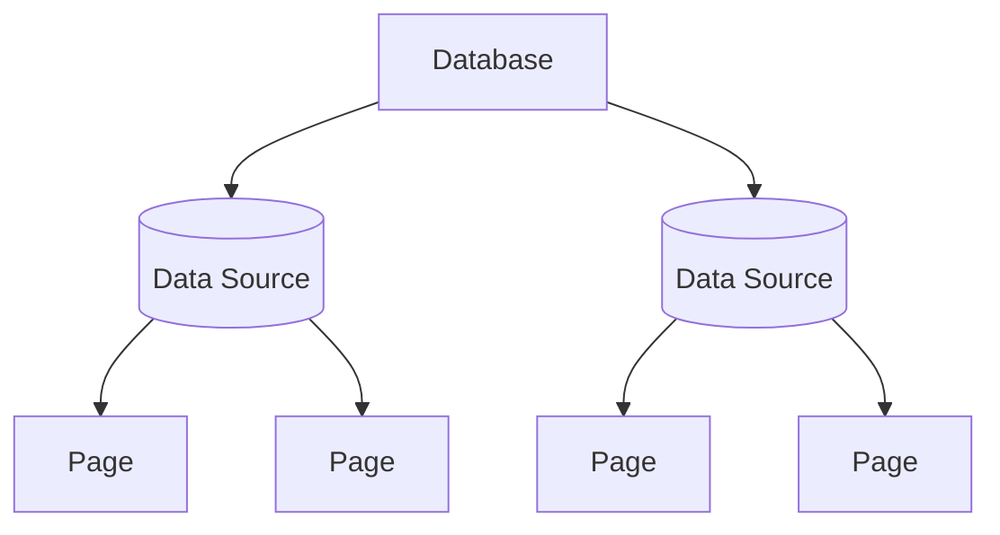

# Data Source

A `DataSource` represents a structured collection of rows (pages) inside a database. It exposes metadata (title, description, icon, cover, trash state) and typed property definitions.



## Finding Data Sources

Data sources are accessed through the `notion.data_sources` namespace:

```python
from notionary import Notionary

async with Notionary() as notion:
    ds = await notion.data_sources.from_title("Features Backlog")
    ds = await notion.data_sources.from_id("your-data-source-id")

    # List / search
    sources = await notion.data_sources.list(query="engineering")

    # Stream
    async for ds in notion.data_sources.iter():
        print(ds.title)
```

## Metadata

```python
await ds.set_title("Sprint Board")

# Icon
await ds.set_icon_emoji("🧭")
await ds.set_icon_url("https://example.com/icon.png")
await ds.set_icon_from_file("./icon.png")
await ds.remove_icon()

# Cover
await ds.set_cover("https://example.com/cover.png")
await ds.random_cover()
await ds.set_cover_from_file("./cover.png")
await ds.remove_cover()

# Trash
await ds.trash()
await ds.restore()
```

## Creating Pages

Create a new page (row) inside the data source:

```python
page = await ds.create_page(title="New Feature")

# Then work with the page normally
await page.append("## Description\nDetails go here.")
await page.properties.set_property("Status", "Todo")
```

## Property Definitions

Every data source carries its property schema. You can inspect the raw definitions:

```python
for name, prop in ds.properties.items():
    print(name, type(prop).__name__)
```

## Reference

!!! info "Notion API Reference"
[Data Sources](https://developers.notion.com/reference/data-source)
