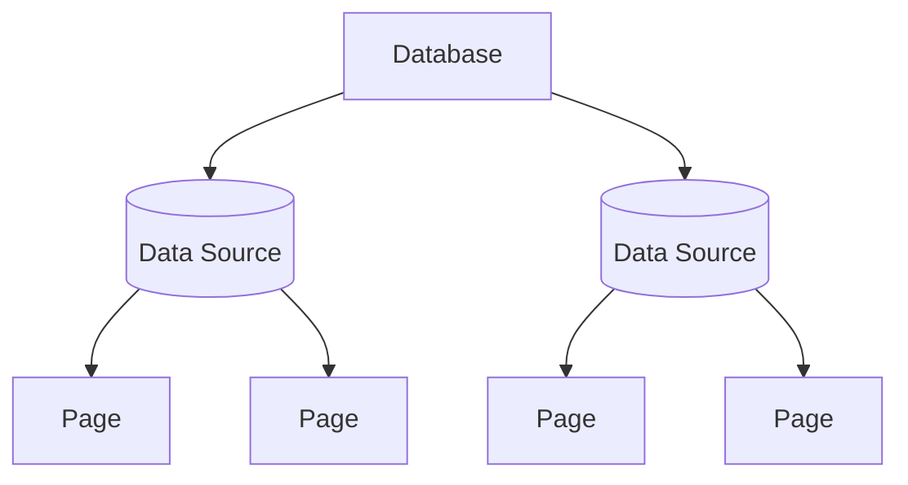

# Data Source

A `DataSource` represents a structured collection of rows (pages) inside a database. It exposes metadata (title, description, icon, cover, trash state) and typed property definitions.



## Finding Data Sources

Data sources are accessed through the `notion.data_sources` namespace:

```python
from notionary import Notionary

async with Notionary() as notion:
    ds = await notion.data_sources.from_title("Features Backlog")
    ds = await notion.data_sources.from_id("your-data-source-id")

    # List / search
    sources = await notion.data_sources.list(query="engineering")

    # Stream
    async for ds in notion.data_sources.iter():
        print(ds.title)
```

## Metadata

```python
await ds.set_title("Sprint Board")

# Icon
await ds.set_icon("🧭")
await ds.set_icon("https://example.com/icon.png")
await ds.set_icon(Path("./icon.png"))
await ds.remove_icon()

# Cover
await ds.set_cover("https://example.com/cover.png")
await ds.random_cover()
await ds.set_cover(Path("./cover.png"))
await ds.remove_cover()

# Trash
await ds.trash()
await ds.restore()
```

## Creating Pages

Create a new page (row) inside the data source:

```python
page = await ds.create_page(title="New Feature")

# Then work with the page normally
await page.append("## Description\nDetails go here.")
await page.properties.set_property("Status", "Todo")
```

## Querying Pages

Query pages with the fluent `Filter` builder:

```python
from notionary.data_source.query import Filter, PropertySort, SortDirection, TimestampSort
```

### Simple filter

```python
pages = await ds.query(
    filter=Filter.status("Status").equals("In Progress")
)

for page in pages:
    print(page.title)
```

### Compound filter (AND / OR)

```python
pages = await ds.query(
    filter=Filter.all(
        Filter.checkbox("Active"),
        Filter.number("Priority").greater_than(3),
    )
)
```

### More filter examples

```python
# Text search
pages = await ds.query(filter=Filter.text("Name").contains("feature"))

# Date ranges
pages = await ds.query(filter=Filter.date("Due").this_week())
pages = await ds.query(filter=Filter.date("Due").past_month())

# Multi-select: pages with ALL of these tags
pages = await ds.query(
    filter=Filter.multi_select("Tags").contains_all("python", "async")
)

# Number range
pages = await ds.query(filter=Filter.number("Price").between(10, 50))

# OR conditions
pages = await ds.query(
    filter=Filter.any(
        Filter.status("Status").equals("In Progress"),
        Filter.status("Status").equals("Review"),
    )
)

# Timestamp shortcuts
pages = await ds.query(filter=Filter.created_this_week())
pages = await ds.query(filter=Filter.edited_after("2025-01-01"))
```

### Sorting

```python
pages = await ds.query(
    sorts=[
        PropertySort(property="Priority", direction=SortDirection.DESCENDING),
        TimestampSort(timestamp="created_time", direction=SortDirection.ASCENDING),
    ]
)
```

### Streaming large result sets

Use `iter_query` to process pages one-by-one without loading all into memory:

```python
async for page in ds.iter_query(
    filter=Filter.text("Name").contains("feature"),
    limit=50,
):
    print(page.title)
```

### Limiting results

```python
# Return at most 10 pages
pages = await ds.query(limit=10)

# Control the API page size (max 100)
pages = await ds.query(page_size=25)
```

### Querying trashed pages

```python
trashed = await ds.query(in_trash=True)
```

### Raw typed filters (escape hatch)

The fluent builder returns the same Pydantic filter types, so you can always
drop down to the raw API when needed:

```python
from notionary.data_source.query import RichTextFilter
from notionary.data_source.query.filters import TextCondition

pages = await ds.query(
    filter=RichTextFilter(property="Name", rich_text=TextCondition(contains="foo"))
)
```

## Property Definitions

Every data source carries its property schema. You can inspect the raw definitions:

```python
for name, prop in ds.properties.items():
    print(name, type(prop).__name__)
```

## Reference

!!! info "Notion API Reference"
[Data Sources](https://developers.notion.com/reference/data-source)
