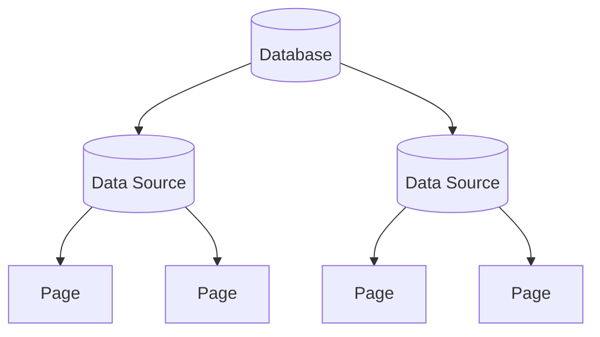

A `Database` in Notionary is a container object that stores structure and presentation metadata (title, description, icon, cover, inline state) and provides access to its data sources. Since API version `2025-09-03`, a database no longer directly stores the row data; instead, each data source attached to it holds the actual pages (rows), and the database acts as an umbrella for those sources.



## Instantiating a Database

You can create a `Database` object using:

```python
from notionary import NotionDatabase

db = await NotionDatabase.from_id("your-database-id")
```

```python
from notionary import NotionDatabase

db = await NotionDatabase.from_title("Tasks")
```

```python
from notionary import NotionDatabase

db = await NotionDatabase.from_url("https://www.notion.so/your-workspace/your-database-id")
```

!!! warning "Limitation with `from_title` since API version 2025-09-03"
    Starting with Notion API version `2025-09-03`, databases are no longer directly searchable through the Notion search API. The `from_title` method now works by searching for data sources linked to databases and inferring the database from those connections. This means:

    - Finding a database by title is **not guaranteed** to work
    - The method may fail if no linked data sources are found
    - **Recommendation**: Use `from_id` or `from_url` whenever possible for reliable database access

    If you need to work with databases interactively and don't have the ID handy, consider first locating a data source that belongs to the database using `NotionDataSource.from_title()`, then accessing its parent database.

## Setting Metadata

You can update database‑level metadata similar to pages:

- Set title
- Set or remove emoji icon
- Set or remove external icon
- Set, randomize, or remove cover image
- Move to trash / restore

### Examples

```python
await db.set_title("Project Tracker")
await db.set_emoji_icon("📊")
await db.set_external_icon("https://example.com/icon.png")
await db.set_cover_image_by_url("https://example.com/cover.png")
await db.set_random_gradient_cover()
await db.remove_cover_image()
await db.move_to_trash()
await db.restore_from_trash()
```

## Working with Data Sources

A database lazily loads its underlying data sources. The first call to `get_data_sources()` triggers a fetch; subsequent calls return the cached list.

```python
data_sources = await db.get_data_sources()
for data_source in data_sources:
    print(data_source.title, data_source.id)
```

Each data source exposes its own properties and can yield pages / rows through its querying interface (see the Data Source documentation for details).

## Reference

!!! info "Notion API Reference"
    For the official Notion API reference on databases, see [https://developers.notion.com/reference/database](https://developers.notion.com/reference/database)
