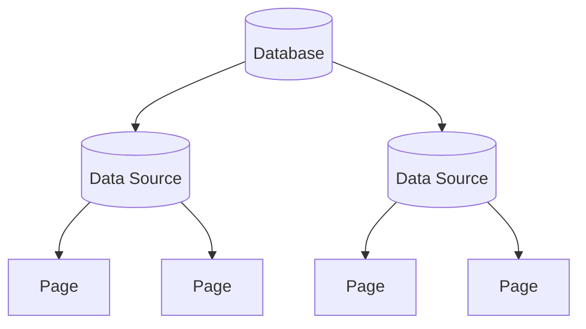

# Database

A `Database` is a container that stores structure and presentation metadata (title, description, icon, cover). Since Notion API version `2025-09-03`, a database no longer directly stores row data — each **data source** attached to it holds the actual pages, and the database acts as an umbrella.


```mermaid
flowchart TD
    DB[(Database)]
    DS1[(Data Source)]
    DS2[(Data Source)]
    P1[Page]
    P2[Page]
    P3[Page]
    P4[Page]

    DB --> DS1
    DB --> DS2
    DS1 --> P1
    DS1 --> P2
    DS2 --> P3
    DS2 --> P4
```

## Finding Databases

Databases are accessed through the `notion.databases` namespace:

```python
from notionary import Notionary

async with Notionary() as notion:
    db = await notion.databases.from_title("Tasks")
    db = await notion.databases.from_id("your-database-id")

    # List / search
    databases = await notion.databases.list(query="tracker")

    # Stream
    async for db in notion.databases.iter():
        print(db.title)
```

## Creating a Database

```python
db = await notion.databases.create(
    parent_page_id=page_id,
    title="Sprint Board",
    description="Tracks sprint items",
    icon_emoji="📊",
)
```

## Metadata

```python
await db.set_title("Project Tracker")
await db.set_description("All active projects")

# Icon
await db.set_icon_emoji("📊")
await db.set_icon_url("https://example.com/icon.png")
await db.set_icon_from_file("./icon.png")
await db.remove_icon()

# Cover
await db.set_cover("https://example.com/cover.png")
await db.random_cover()
await db.set_cover_from_file("./cover.png")
await db.remove_cover()

# Inline display
await db.set_inline(True)

# Lock / unlock
await db.lock()
await db.unlock()

# Trash
await db.trash()
await db.restore()
```

## Data Source References

Each database exposes a list of `DataSourceReference` objects describing its attached data sources:

```python
for ref in db.data_sources:
    print(ref.id, ref.type)
```

To work with pages inside a database, use the data source API — see [Data Source](data_source/index.md).

## Reference

!!! info "Notion API Reference" - [Databases](https://developers.notion.com/reference/database) - [Data Sources](https://developers.notion.com/reference/data-source)
