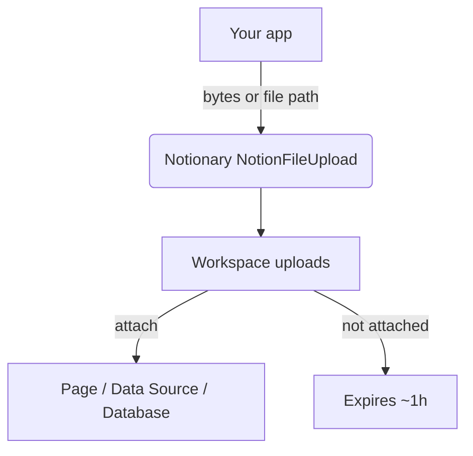

# File Uploads

The `NotionFileUpload` service uploads files into your workspace so you can attach them to pages, data sources, or databases later. Temporary uploads expire if they are not attached.



Keep it simple:
- Upload from disk or bytes
- Attach to existing entities when ready
- Use the resolver utility to find files on disk quickly

## Instantiating

```python
from notionary import NotionFileUpload

file_uploader = NotionFileUpload()
```

## Upload from disk

```python
from pathlib import Path

# Wait for completion (default)
response = await file_uploader.upload_file(Path("./images/logo.png"))
print(response.id, response.status)  # status = UPLOADED

# Return immediately without waiting
response = await file_uploader.upload_file(
	Path("./images/logo.png"),
	wait_for_completion=False
)
print(response.id, response.status)  # status = PENDING
# Poll later with get_upload_status(response.id)

# Optional filename override
response = await file_uploader.upload_file(Path("./images/temp.png"), filename="brand.png")
```

## Upload from bytes (e.g., AI‑generated)

```python
image_bytes = generate_image_somehow()

# Wait for completion (default)
response = await file_uploader.upload_from_bytes(
	file_content=image_bytes,
	filename="ai_cover.png",
	content_type="image/png",
)
print(response.id)  # status = UPLOADED

# Return immediately without waiting
response = await file_uploader.upload_from_bytes(
	file_content=image_bytes,
	filename="ai_cover.png",
	content_type="image/png",
	wait_for_completion=False,
)
print(response.id)  # status = PENDING
```

If omitted, `content_type` is guessed from the filename using Python's `mimetypes`.

## Where to next?

- Attach uploads: see [Integration](integration.md)
- List and filter uploads: see [Query](query.md)
- Resolve local paths and scan folders: see [Resolver](resolver.md)

## Polling & status

By default, `upload_file()` and `upload_from_bytes()` wait until the upload reaches a terminal status (uploaded/failed). If you set `wait_for_completion=False`, the method returns immediately with status `PENDING` and you can poll later:

```python
# Immediate return
response = await file_uploader.upload_file(Path("./file.zip"), wait_for_completion=False)
print(response.status)  # FileUploadStatus.PENDING

# Poll manually
status = await file_uploader.get_upload_status(response.id)
print(status)  # "uploaded", "pending", "failed", or "expired"
```

## Error handling

- `UploadFailedError`: a part failed to send or the final status is `failed`.
- `UploadTimeoutError`: overall upload did not complete within the configured timeout.
- Validation errors: filename too long, size exceeds configured maximum, or invalid number of parts.

```python
try:
	response = await uploader.upload_file(Path("big.zip"))
except UploadTimeoutError:
	print("Timed out – retry later")
except UploadFailedError as e:
	print("Failed:", e)
```
