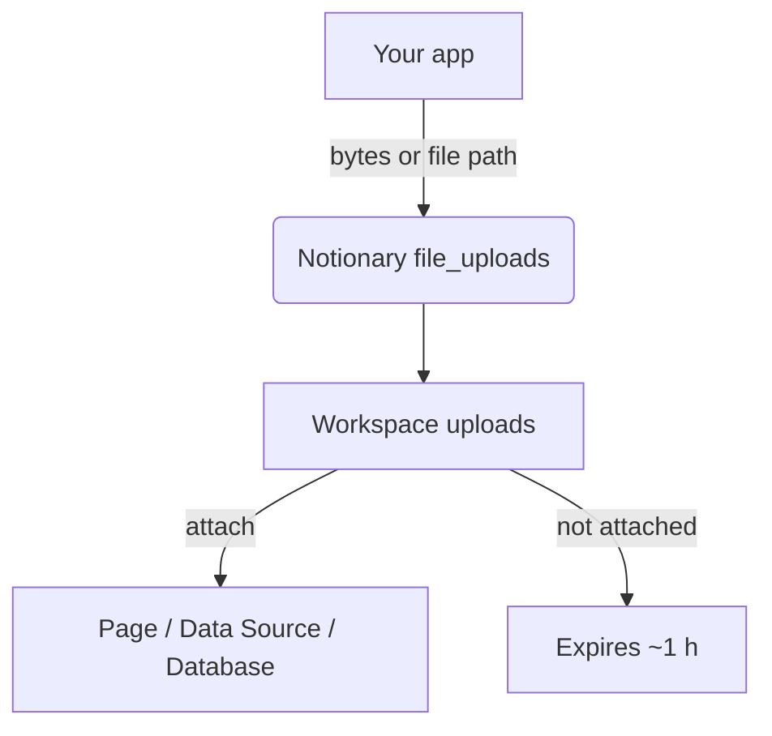

# File Uploads

The `file_uploads` namespace uploads files into your Notion workspace so you can attach them to pages, databases, or data sources. Temporary uploads expire if not attached.


```mermaid
flowchart TD
    A[Your app] -->|bytes or file path| B(Notionary file_uploads)
    B --> C[Workspace uploads]
    C -->|attach| D[Page / Data Source / Database]
    C -->|not attached| E[Expires ~1 h]
```

## Upload from Disk

```python
from pathlib import Path
from notionary import Notionary

async with Notionary() as notion:
    # Wait for completion (default)
    response = await notion.file_uploads.upload_file(Path("./images/logo.png"))
    print(response.id, response.status)

    # Return immediately
    response = await notion.file_uploads.upload_file(
        Path("./images/logo.png"), wait=False
    )

    # Optional filename override
    response = await notion.file_uploads.upload_file(
        Path("./images/temp.png"), filename="brand.png"
    )
```

## Upload from Bytes

```python
response = await notion.file_uploads.upload_from_bytes(
    content=image_bytes,
    filename="ai_cover.png",
    content_type="image/png",
)
```

If omitted, `content_type` is guessed from the filename.

## Polling & Status

When `wait=False`, poll manually:

```python
response = await notion.file_uploads.upload_file(Path("./file.zip"), wait=False)
status = await notion.file_uploads.get(response.id)
print(status.status)
```

## Error Handling

- `UploadFailedError` — upload failed or a part failed to send
- `UploadTimeoutError` — did not complete within the configured timeout
- Validation errors for filename length, missing extension, or unsupported file type

## Where to Next?

- Attach uploads: see [Integration](integration.md)
- List and filter uploads: see [Query](query.md)
- Resolve local paths and scan folders: see [Resolver](resolver.md)

## Reference

!!! info "Notion API Reference"
[File Uploads](https://developers.notion.com/reference/file-uploads)
