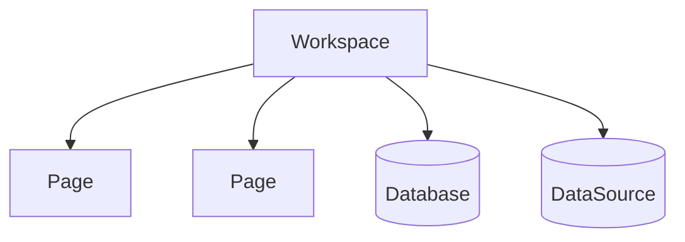

# Workspace

A `Workspace` represents the global scope of your Notion integration. It lets you search across all pages and data sources in the workspace and enumerate users. Use it when you need discovery by keyword or want to iterate across many entities.



## Instantiating a Workspace

```python
from notionary import NotionWorkspace

workspace = await NotionWorkspace.from_current_integration()
```

## Querying pages and data sources

Workspace search is powered by Notion's Search API. In Notionary, you must provide an explicit `WorkspaceQueryConfig` built with `NotionWorkspaceQueryConfigBuilder`.

### Building and executing queries

```python
from notionary import NotionWorkspace
from notionary.workspace.query.builder import NotionWorkspaceQueryConfigBuilder

workspace = await NotionWorkspace.from_current_integration()

# Build config for pages
builder = NotionWorkspaceQueryConfigBuilder()
config = builder.with_pages_only().with_query("roadmap").with_page_size(10).build()
pages = await workspace.get_pages(config)

# Build config for data sources
builder = NotionWorkspaceQueryConfigBuilder()
config = builder.with_data_sources_only().with_query("engineering").with_page_size(5).build()
data_sources = await workspace.get_data_sources(config)

# Get all pages without filters
all_pages = await workspace.get_pages()
```

### Streaming results (memory-efficient)

The stream variants return an async generator that yields `NotionPage` or `NotionDataSource` objects as they are fetched. This is memory-efficient and well-suited for automated pipelines since you can process items one-by-one without loading the entire result set into memory.

```python
from notionary import NotionWorkspace
from notionary.workspace.query.builder import NotionWorkspaceQueryConfigBuilder

workspace = await NotionWorkspace.from_current_integration()

# Stream pages with filter
builder = NotionWorkspaceQueryConfigBuilder()
config = builder.with_pages_only().with_query("spec").build()

async for page in workspace.iter_pages(config):
	print(page.title)

# Stream data sources with filter
builder = NotionWorkspaceQueryConfigBuilder()
config = builder.with_data_sources_only().with_query("team").build()

async for ds in workspace.iter_data_sources(config):
	print(ds.title)

# Stream all pages
async for page in workspace.iter_pages():
	print(page.title)
```

## Finding by best match

When you know a title (or part of it), you can use best-match finders that consult the search API and perform fuzzy matching. These raise a helpful error with a few suggestions if no sufficiently similar item is found.

```python
from notionary import NotionWorkspace

workspace = NotionWorkspace()

page = await workspace._query_service.find_page("Onboarding Guide", min_similarity=0.7)

ds = await workspace._query_service.find_data_source("Engineering Backlog", min_similarity=0.7)

db = await workspace._query_service.find_database("Product")
```

Note: The finders currently live on the underlying `WorkspaceQueryService` and return fully-instantiated `NotionPage`, `NotionDataSource`, or `NotionDatabase` objects.

## Users

You can enumerate users and bot users in the workspace, and you can search for users by query string.

```python
from notionary import NotionWorkspace

workspace = NotionWorkspace()

users = await workspace.get_users()

async for user in workspace.get_users_stream():
	print(user.name)

bot_users = await workspace.get_bot_users()

async for bot in workspace.get_bot_users_stream():
	print(bot.name)

matches = await workspace.search_users("alex")

async for user in workspace.search_users_stream("alex"):
	print(user.name)
```

## Reference

!!! info "Notion API Reference"
For the official Notion API reference on search, see https://developers.notion.com/reference/post-search
